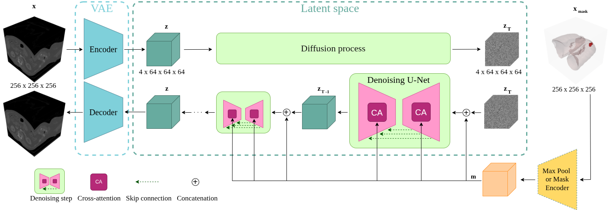

# 🚀 LAND: Lung and Nodule Diffusion for 3D Chest CT Synthesis with Anatomical Guidance
[](https://doi.org/10.1038/s41598-026-51634-4)
[](https://aolivtous.github.io/publications/land.html)
[](https://opensource.org/licenses/Apache-2.0)
[](http://creativecommons.org/licenses/by-nc-nd/4.0/)



This is the official PyTorch implementation of the paper **"Anatomically guided latent diffusion for high-resolution 3D chest CT synthesis"** (project name: **LAND**), published in *Scientific Reports* (2026), by Anna Oliveras, Roger Marí, Rafael Redondo, Oriol Guardià, Cynthia Ifeyinwa Ugwu, Ana Tost, Bhalaji Nagarajan, Carolina Migliorelli, Vicent Ribas and Petia Radeva.

📄 [Read the paper](https://doi.org/10.1038/s41598-026-51634-4) and 🚀 [Check out the project page](https://aolivtous.github.io/publications/land.html) for interactive sample viewer, talks & posters!

---
## 🧭 Pipeline Overview
Reproducing LAND means running four stages, in this order — each one depends on the output of the previous:

| # | Stage | Script | Produces / needs |
|---|-------|--------|-------------------|
| 1 | **Preprocess data** | `scripts/preproc_data.sh` | Converts raw LIDC-IDRI DICOMs into `.npy` CT volumes + conditioning masks. Everything downstream reads from this output. |
| 2 | **Train the image VAE** | `scripts/train_vae.sh` | Compresses CT volumes (`chest_ct/*.npy`) into a latent space. Needed by the LDM as `vae_dir`. |
| 3 | **Train the mask VAE** | `scripts/train_vae_masks.sh` | Compresses conditioning masks (nodule/lung/texture, `mask/*.npy`) into a latent space. Needed by the LDM as `vae_mask_dir`. |
| 4 | **Train the LDM** | `scripts/train_ldm.sh` | Trains the diffusion model in the joint latent space, loading the pretrained checkpoints from steps 2 and 3. |


## 📦 Dependencies
You can create a conda environment with all the requirements using the following commands:

```sh
conda env create -f environment.yml
conda activate land
```

## 🗂️ Data
LAND was trained using the publicly available dataset **[LIDC-IDRI](https://www.cancerimagingarchive.net/collection/lidc-idri/)**, containing thoracic computed tomography (CT) scans of lung cancer patients.

To save you from having to regenerate our anatomical masks from scratch, we provide our own precomputed masks for both **LIDC** and **NLST** [here](https://eurecatcloud-my.sharepoint.com/:f:/r/personal/anna_oliveras_eurecat_org/Documents/LAND_datasets?csf=1&web=1&e=KmSAuf):

- **LIDC** — only the masks are ours to share. The `chest_ct/*.npy` files in this download are empty placeholders, not real CT data. Download the real LIDC-IDRI DICOMs yourself from the link above and run `scripts/preproc_data.sh` (see below), which regenerates the real `chest_ct/*.npy` volumes at the exact same paths, overwriting the placeholders. The masks themselves need no regeneration.
- **NLST** — masks only, and nothing further to do. NLST is used exclusively as a `--mask_dataset` for inference purposes: its chest CT content is never read by any part of the pipeline, so this download is immediately usable as-is. There are no images to download or substitute for NLST.

LIDC preprocessing is handled by `scripts/preproc_data.sh`, which converts raw DICOM studies into the `.npy` volumes and masks used to train the VAE and LDM.

```bash
bash scripts/preproc_data.sh
```

**What it does:**
- Points `pylidc` at your DICOM root directory
- Reads DICOM files from `DICOM_DIR`
- Normalizes, resamples, and center-crops each volume
- Saves the resulting CT image and mask `.npy` files to `NPY_DIR`
- (Optional) saves PNG slice sequences to `PNG_DIR`
# 🫁  VAEs
## Training
To train the image VAE run:

```bash
bash scripts/train_vae.sh
```

This script launches the training process for a Variational Autoencoder (VAE) on the preprocessed `.npy` LIDC volumes produced by `scripts/preproc_data.sh` (see the Data section above) — the same `.npy` format used everywhere else in the pipeline.

Before running the script, check and adjust the following:

| Variable              | Description                                                         | Example                                                               |
|-----------------------|-----------------------------------------------------------------------|--------------------------------------------------------------------------|
| MODEL_CONFIG          | Path to the VAE model architecture config file                      | src/vae/configs/config_vae.json                                       |
| TRAIN_CONFIG          | Path to the VAE training hyperparameter config                      | src/vae/configs/config_vae_train.json                                 |
| DATASET_PATH          | Path to the preprocessed `.npy` dataset                             | /data/datasets/LIDC_LAND/                          |
| LOG_PATH              | Directory for saving training logs                                  | logs/vae/logging/                                                     |
| TENSORBOARD_LOG_DIR   | Directory to write TensorBoard logs                                 | logs/vae/tensorboard/                                                 |
| MODEL_DIR             | Directory where model checkpoints will be saved                     | checkpoints/vae/                                                      |
| TRAIN_PORTION         | Fraction of dataset to use for training                             | 0.9                                                                    |
| RUN_NAME              | Name identifier for this training run (used in logs/W&B)            | vaeLAND                                                                |

To enable Weights & Biases logging, uncomment the `--enable_wandb` line at the bottom of the script; comment it out to disable.

A second VAE is used to encode the conditioning masks (nodule/lung/texture) into the latent space consumed by the LDM. To train it, run:

```bash
bash scripts/train_vae_masks.sh
```

This follows a similar structure to `train_vae.sh`, with a few mask-specific additions:

| Variable        | Description                                                                 | Example        |
|-----------------|------------------------------------------------------------------------------|-----------------|
| MASK_MODE       | Which mask channels to train on: `"nodule"`, `"nodule+lung"`, or `"nodule+lung+texture"` | nodule+lung     |
| LATENT_SIZE     | Latent bottleneck size for the mask VAE                                     | 1               |
| NUM_CLASSES     | Auto-derived from `MASK_MODE` (2/3/7 respectively) — no need to set manually | (auto)          |

`MODEL_CONFIG`, `TRAIN_CONFIG`, `DATASET_PATH`, `LOG_PATH`, `TENSORBOARD_LOG_DIR`, `MODEL_DIR`, `TRAIN_PORTION`, `RUN_NAME` behave the same as in `train_vae.sh` above.

# 🎨 LDM
## Training
To train the LDM LAND pipeline run:
```bash
bash scripts/train_ldm.sh
```
This script trains a Latent Diffusion Model (LDM) on medical image data using optional conditioning masks, VAE compression, and configurable experiment setups.

Before running the script, check and adjust the following:

| Variable               | Description                                                                 | Example                                                                 |
|------------------------|------------------------------------------------------------------------------|--------------------------------------------------------------------------|
| log_dir                | Directory to store training logs and TensorBoard outputs                    | logs/ldm/                                                               |
| model_dir              | Directory where LDM model checkpoints will be saved                         | checkpoints/ldm/                                                        |
| vae_dir                | Path to pretrained image-VAE checkpoint directory (from `train_vae.sh`, stage 2)  | checkpoints/vae/20250514-123257/vae_best_epoch/                   |
| vae_mask_dir           | Path to pretrained mask-VAE checkpoint directory (from `train_vae_masks.sh`, stage 3); required whenever `mask_mode` is not `none` | checkpoints/vaeMasks/vaeMasks_noduleLungTexture_latent1_20260408-182911/vae_best_epoch/ |
| image_dataset          | Path to real `.npy` dataset for training                                    | /data/datasets/LIDC_LAND/                        |
| mask_dataset           | Path to optional `.npy` dataset with segmentation masks                     | /data/datasets/LIDC_LAND/ |
| num_epochs             | Number of training epochs                                                    | 500                                                                     |
| num_inference_steps    | Number of denoising steps during sample generation                          | 1000                                                                      |
| save_freq              | How often to save model checkpoints (in epochs)                             | 10                                                                      |
| save_freq_imgs         | How often to run validation inference and save sample output images (in epochs) | 25                                                                  |
| resolution             | Image resolution (input and output)                                         | 256                                                                     |
| lr                     | Learning rate                                                               | 1e-5                                                                    |
| bsz                    | Batch size                                                                  | 1                                                                       |
| prediction_type        | Denoising prediction strategy (e.g., "v_prediction")                        | v_prediction                                                            |
| ckpt_path *(optional)* | Path to a checkpoint directory to resume training from                      | checkpoints/ldm/.../checkpoint-35/                                      |
| EXPERIMENT_CONFIGS     | Array of experiment setups with extra CLI args                              | e.g., "nodule_mask:--mask_mode nodule --mask_dataset $mask_dataset"    |

### Experiment Modes:
Each experiment proposed in the paper is defined as a string in the format: "experiment_name:extra_args". Uncomment the desired experiments in `EXPERIMENT_CONFIGS` array to activate them. We used the flag `--attention`, which activates attention layers, in all our experiments.

Examples:
- Unconditional experiment: `"unconditional:--mask_mode none --attention"`
- Conditional experiment on nodule masks: `"nodule_mask:--mask_mode nodule --mask_dataset $mask_dataset --attention"`
- Conditional experiment on nodule+lung masks: `"nodule+lung_mask:--mask_mode nodule+lung --mask_dataset $mask_dataset --attention"`
- Conditional experiment on nodule+lung+texture masks: `"nodule+lung+texture_mask:--mask_mode nodule+lung+texture --attention"`

### Output:
- Model checkpoints saved in `model_dir/<experiment_id>/.`
- Logs and TensorBoard files saved in `log_dir/<experiment_id>/.`
- Optional visual outputs (samples, reconstructions) saved per save interval.

*`<experiment_id>`: Experiment names auto-generated based on resolution, batch size, LR, and experiment type.

## Inference
To run inference with the LDM LAND pipeline:
```bash
bash scripts/inference_ldm.sh
```
This script runs inference with trained Latent Diffusion Models (LDM) on medical image data using optional segmentation masks and VAE-compressed inputs. Generated samples are saved named after their conditioning mask (e.g. `LIDC-IDRI-0001.npy`), for direct 1:1 tracking back to the source mask.

Before running the script, check and adjust the following:

| Variable       | Description                                                                 | Example                                                                          |
|----------------|--------------------------------------------------------------------------------|-----------------------------------------------------------------------------------|
| VAE_PATH       | Path to the trained image-VAE model checkpoint (from `train_vae.sh`)        | checkpoints/vae/20250514-123257/vae_best_epoch/                                 |
| VAE_MASK_PATH  | Path to the trained mask-VAE model checkpoint (from `train_vae_masks.sh`); passed on every run regardless of `mask_mode` | checkpoints/vaeMasks/vaeMasks_noduleLungTexture_latent1_20260408-182911/vae_best_epoch/ |
| MASK_DATASET   | Path to the mask `.npy` dataset (used if `mask_mode` is not `none`)         | /data/datasets/NLST_LAND/          |
| SAVE_FOLDER    | Root directory where generated samples will be saved                        | outputs/LAND_inferences/                                  |
| LATENTS_DIR    | (Optional) Path to precomputed VAE latents to reuse across experiments      | leave empty to compute latents on-the-fly                                       |
| BATCH_SIZE     | Batch size used during inference                                             | 1                                                                                |
| configs        | Array of `"MODEL_PATH NUM_SAMPLES STEPS"` triples, one per experiment to run | "checkpoints/ldm/2026-04-13_00-10-32_..._mask 3 1000"                           |

The script auto-detects `mask_mode` from each `MODEL_PATH` to condition the LDM accordingly:
- `nodule_mask → --mask_mode nodule`
- `nodule+lung_mask → --mask_mode nodule+lung`
- `nodule+lung+texture_mask → --mask_mode nodule+lung+texture`
- `default/none → --mask_mode none`

# ⚖ License
The article is Open Access under **CC BY-NC-ND 4.0** (non-commercial use and sharing permitted with attribution; no derivatives of the article/figures).  This code repository is separately licensed under **Apache License 2.0** (see `LICENSE`).

# 📝 Cite
If you find our work useful, please consider to ⭐ star this repository and cite our paper:
```bibtex
@article{Oliveras2026,
  author  = {Oliveras, Anna and Marí, Roger and Redondo, Rafael and Guardià, Oriol and Ugwu, Cynthia Ifeyinwa and Tost, Ana and Nagarajan, Bhalaji and Migliorelli, Carolina and Ribas, Vicent and Radeva, Petia},
  title   = {Anatomically guided latent diffusion for high-resolution 3D chest CT synthesis},
  journal = {Scientific Reports},
  year    = {2026},
  doi     = {10.1038/s41598-026-51634-4}
}
```

# 🙏 Acknowledgement
Some codes in this repository are modified from [wdm-3d](https://github.com/pfriedri/wdm-3d) and [MAISI](https://github.com/Project-MONAI/tutorials/blob/main/generation/maisi/README.md).
